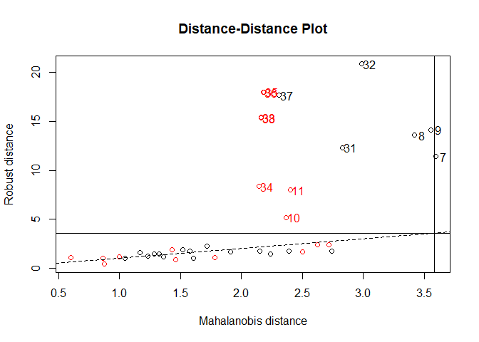
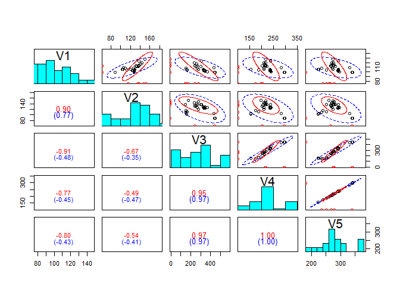
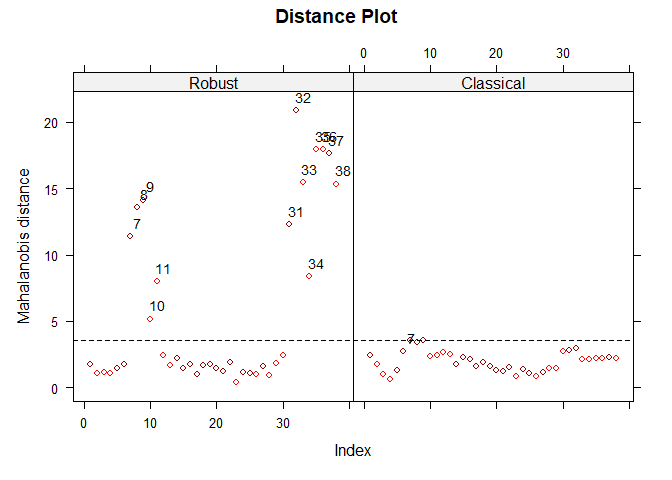
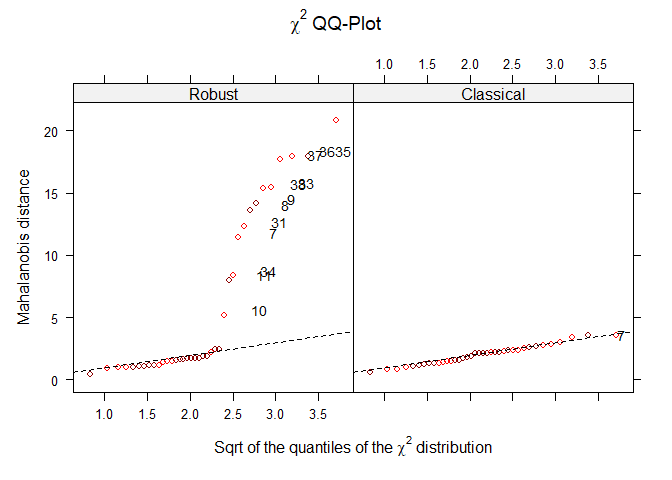

<!-- README.md is generated from README.Rmd. Please edit that file -->

# `rrcovNA`: Scalable Robust Estimators with High Breakdown Point for Incomplete Data

<!-- badges: start -->

[](https://cran.r-project.org/package=rrcovNA)
[](https://github.com/valentint/rrcovNA/actions)
[](https://cran.r-project.org/package=rrcovNA)
[](https://cran.r-project.org/package=rrcovNA)
[](https://www.gnu.org/licenses/gpl-3.0.en.html)
[](https://github.com/valentint/rrcovNA/actions/workflows/R-CMD-check.yaml)
[](https://app.codecov.io/gh/valentint/rrcovNA?branch=main)
<!-- badges: end -->

The package `rrcovNA` provides scalable robust estimators with high
breakdown point for incomplete data (missing values) (Todorov et
al. (2010) <doi:10.1007/s11634-010-0075-2>).

## Installation

The `rrcovNA` package is on CRAN (The Comprehensive R Archive Network)
and the latest release can be easily installed using the command

    install.packages("rrcovNA")
    library(rrcovNA)

## Building from source

To install the latest stable development version from GitHub, you can
pull this repository and install it using

    ## install.packages("remotes")
    remotes::install_github("valentint/rrcovNA", build_opts = c("--no-build-vignettes"))

Of course, if you have already installed `remotes`, you can skip the
first line (I have commented it out).

## Example

This is a basic example which shows you if the package is properly
installed:

``` r

library(rrcovNA)
#> Loading required package: rrcov
#> Loading required package: robustbase
#> Scalable Robust Estimators with High Breakdown Point (version 1.7-3)
#> Scalable Robust Estimators with High Breakdown Point for
#> Incomplete Data (version 0.5-0)
data(bush10)
mcd <- CovNAMcd(bush10)
mcd
#> 
#> Call:
#> CovNAMcd(x = bush10)
#> -> Method:  Minimum Covariance Determinant Estimator for incomplete data. 
#> 
#> Robust Estimate of Location: 
#>    V1     V2     V3     V4     V5  
#> 109.5  149.5  257.9  215.0  276.9  
#> 
#> Robust Estimate of Covariance: 
#>     V1       V2       V3       V4       V5     
#> V1    697.6    489.3  -3305.1   -671.4   -550.5
#> V2    489.3    424.5  -1889.0   -333.5   -289.5
#> V3  -3305.1  -1889.0  18930.9   4354.2   3456.4
#> V4   -671.4   -333.5   4354.2   1100.1    856.0
#> V5   -550.5   -289.5   3456.4    856.0    671.7
summary(mcd)
#> 
#> Call:
#> CovNAMcd(x = bush10)
#> 
#> Robust Estimate of Location: 
#>    V1     V2     V3     V4     V5  
#> 109.5  149.5  257.9  215.0  276.9  
#> 
#> Robust Estimate of Covariance: 
#>     V1       V2       V3       V4       V5     
#> V1    697.6    489.3  -3305.1   -671.4   -550.5
#> V2    489.3    424.5  -1889.0   -333.5   -289.5
#> V3  -3305.1  -1889.0  18930.9   4354.2   3456.4
#> V4   -671.4   -333.5   4354.2   1100.1    856.0
#> V5   -550.5   -289.5   3456.4    856.0    671.7
#> 
#> Eigenvalues of covariance matrix: 
#> [1]  21334.429    428.703     56.662      3.701      1.263
#> 
#> Robust Distances: 
#>  [1]    3.1071    1.1127    1.3864    1.1215    2.1500    3.0780  130.1256
#>  [8]  185.1492  200.1491   26.7795   63.9884    5.8178    2.8298    4.9464
#> [15]    2.1220    3.1128    1.0421    2.7172    2.9548    2.0638    1.4335
#> [22]    3.4786    0.1621    1.2949    1.0765    1.0287    2.5304    0.7860
#> [29]    3.4224    5.8211  151.4576  435.4440  238.2627   69.9555  323.5308
#> [36]  322.8153  312.4068  235.6941

plot(mcd)
```

<!-- -->

``` r
plot(mcd, which="pairs")
```

<!-- -->

``` r
plot(mcd, which="xydistance")
```

<!-- -->

``` r
plot(mcd, which="xyqqchi2") 
```

<!-- --> \## Community guidelines

### Report issues and request features

If you experience any bugs or issues or if you have any suggestions for
additional features, please submit an issue via the
[*Issues*](https://github.com/valentint/rrcovNA/issues) tab of this
repository. Please have a look at existing issues first to see if your
problem or feature request has already been discussed.

### Contribute to the package

If you want to contribute to the package, you can fork this repository
and create a pull request after implementing the desired functionality.

### Ask for help

If you need help using the package, or if you are interested in
collaborations related to this project, please get in touch with the
package maintainer.
